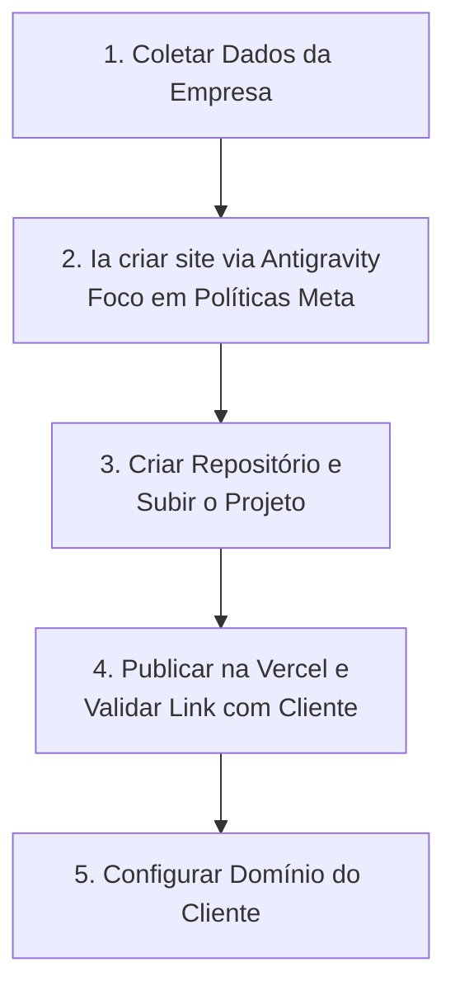

# Fluxo de Criação e Publicação de Site

Este documento descreve o processo passo a passo para a criação e publicação de um site, desde a coleta inicial de dados até a configuração final do domínio, garantindo a conformidade com as políticas da Meta.

## 1. Coleta de Dados
* **Ação:** Obter informações detalhadas do cliente sobre a empresa. Os dados obrigatórios a serem coletados são:
  * Nome da empresa
  * CNPJ
  * Endereço
  * Bairro
  * CEP
  * Cidade/Estado
  * E-mail
  * WhatsApp / Telefone de contato
  * Segmento da empresa
  * Informações adicionais sobre produto/serviço
* **Objetivo:** Reunir todos os insumos necessários detalhadamente para a customização e estruturação do site.

## 2. Geração do Site (via AI - Antigravity)
* **Ação:** Fornecer os dados coletados para a inteligência artificial (Antigravity).
* **Diretrizes:** A IA DEVE OBRIGATORIAMENTE realizar a leitura dos seguintes documentos de base:
  * `documento-completo-politicas-e-instrucoes.md`
  * `instrucoes-landing-pages-meta.md`
  * `politicas-meta.md`
  
  Após a leitura obrigatória, a IA deve gerar o código fonte completo do site (HTML, CSS, JS) utilizando todas as diretrizes e regras constadas nos documentos, alimentando as seções com os dados preenchidos pelo cliente na Etapa 1.
  
  * **Regra Especial de Conversão:** A IA deve estruturar obrigatoriamente um formulário de contato (coletando Nome e Mensagem) cujo evento de envio ("submit") capture os dados e redirecione imediatamente o usuário para o WhatsApp. Além disso, todos os CTAs de contato da página devem apontar para o WhatsApp.
* **Objetivo:** Criar um site otimizado, responsivo e estritamente adequado para aprovação no Gerenciador de Negócios (BM) e na API do WhatsApp.

## 3. Versionamento de Código
* **Ação:** Inicializar um repositório Git local e enviá-lo para a nuvem.
* **Procedimento:** Criar um repositório remoto (ex: GitHub), efetuar o `commit` dos arquivos gerados e realizar o `push` do projeto.
* **Objetivo:** Manter um histórico de versões seguro e preparar a integração com a plataforma de hospedagem.

## 4. Publicação e Análise
* **Ação:** Realizar o deploy do projeto na Vercel.
* **Procedimento:** Conectar o repositório estruturado na etapa 3 à Vercel. O sistema gerará um link temporário (ex: `nome-empresa.vercel.app`).
* **Objetivo:** Obter a URL de homologação e enviá-la para o cliente para que possa visualizar, validar e aprovar o site.

## 5. Configuração de Domínio
* **Ação:** Configurar o domínio próprio aprovado.
* **Procedimento:** Após a aprovação do cliente, apontar as configurações de DNS do domínio oficial para os servidores da Vercel.
* **Objetivo:** Garantir a URL em produção (ex: `www.empresa.com.br`) e assegurar tráfego via certificado SSL de forma definitiva.

---

### Visão Geral do Fluxo

